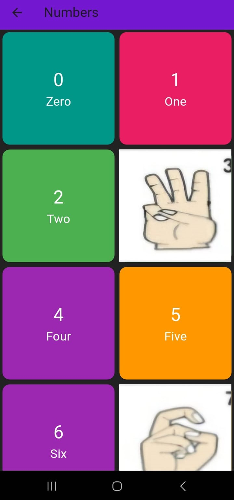

# MounaSakhi: A Learning app for the Deaf and the Mute with Speech to ISL Conversion

**MounaSakhi** is a Flutter-based mobile application designed to assist individuals with hearing and speech impairments. The app provides a user-friendly platform to translate speech and text into Indian Sign Language using an animated avatar. Additionally, it is bilingual, supporting both English and Kannada for broader accessibility.

---

## Key Features

- **Speech-to-Sign Translation**: Converts spoken words into Indian Sign Language.  
- **Text-to-Sign Translation**: Translates written text into animated sign language.  
- **Bilingual Support**: Provides support for both English and Kannada, catering to a wider audience.  
- **Educational Resource**: Helps users learn Indian Sign Language through an interactive interface.  
- **Accessible Design**: Built to accommodate diverse user needs with a simple and intuitive UI.  

---

## Tech Stack

### Frontend
- **Flutter**: For creating a cross-platform mobile application.
- **Dart**: Programming language for Flutter.

### Backend
- **Flask**: Manages API requests and integrates the ML model.
- **Python**: For backend logic and ML integration.

### Machine Learning
- **Google Speech-to-Text API**: Converts speech input into text for further processing.
- **Custom Animation Models**: For rendering sign language animations.

---

## Screenshots

### 1. Home Screen
The home screen where the user begins the app.

  
  

### 2. Options Screen
The options screen where users can choose between different features like learning, speech-to-sign, and text-to-sign converters.

  
  

### 3. Learning Screens
The learning section with options for learning letters, words, and numbers.

  
  
  
  
  
  

### 4. Speech-to-ISL Screens
The screen for speech-to-sign translation.

  
  
  

### 5. Text-to-ISL Screens
The screen for text-to-sign translation.

  
  
  

### 6. Avatars
The animated avatars for ISL translation.

  
  
  
  

